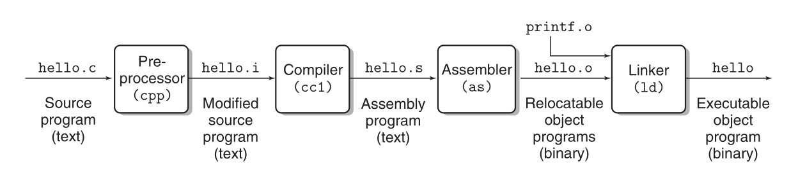
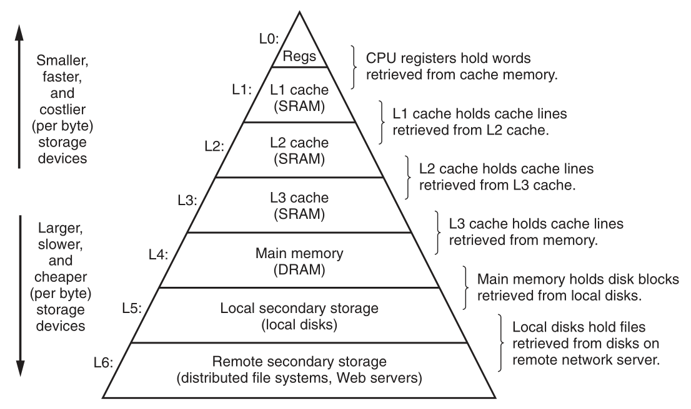
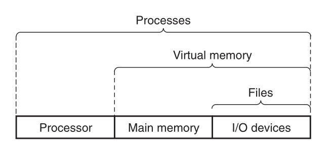
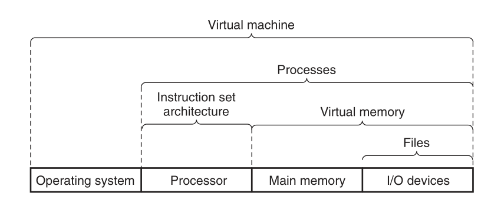
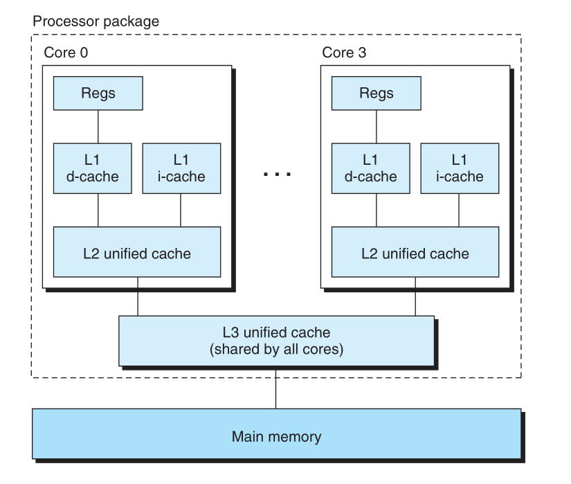

# 第一章和第二章

CS:APP 学习过程记录

文中的插图出自 Computer Systems: A Programmer's Perspective, 3/E (CS:APP3e). 版权归原作者所有.

#### 编译系统流程

编译的过程记录在 [基本编译操作](https://github.com/jinmiaoluo/cplay/blob/master/example-1-basic-compilation-operations)

如何用 GDB 调试见: [基本调试步骤](https://github.com/jinmiaoluo/cplay/tree/master/example-2-basic-debug-step)

#### 大端小端

我们现在常用的 PC (Intel 或者 AMD)是小端形式存放的二进制.

保存一个比较大的整数的二进制时, 假设该整数是: 4142. 这个数的十六进制是: 0x102e. 大端小端的区别就是二进制表示这个整数. 高位的数是按照人的直觉那样, 高位在前低位在后表示(大端). 还是低位在前高位在后(小端).

大端: 该整数的表示顺序是 `10 2e`
小端: 该整数的表示顺序是 `2e 10`

#### 关于操作系统

操作系统的主要作用:

1. 防止软件对硬件的滥用
2. 提供统一和简单的机制来使用硬件

操作系统上的软件与硬件(即从软件的角度, 如果要访问这些硬件, 这些硬件相当于什么):
- I/O 设备: 文件
- 主存和 I/O 设备: 虚拟内存地址
- 处理器和主存和 I/O 设备: 进程

#### 关于字长(word size)

字长用于表示指针数据的大小. 一个最重要的作用是表示最大的虚拟地址空间的大小. 常见的 64 位系统和 32 位系统中的 `64` 和 `32` 表示的就是字长的大小.

#### 虚拟内存

操作系统提供的内存和 I/O 设备的抽象. 让进程以为自己独占了整个主存(虚拟地址空间). 主要的思路是: 将进程的虚拟内存存放到硬盘. 然后通过主存作为缓存. 操作系统通过复杂的交互. 实现虚拟地址空间内的虚拟地址到真实的物理地址的转换.

#### 缓存与抽象

关于缓存:

作用: 上级设备更快成本更高. 容量也比较小. 计算机硬件中的缓存的目的是通过总线将数据从低速设备复制到高速设备. 从而加速数据的读写.

PS: 互联网通信也可以被看作是 I/O 设备.

关于抽象(操作系统的层面):

作用: 在操作系统上通过抽象来隐藏硬件的复杂度. 从而实现统一且简单的使用硬件的方法.

#### CPU

#### 进程与线程

进程有自己独立的上下文(内存地址空间中的数据).
线程共享了进程的上下文

- TODO: 为何线程可以提高性能.

#### 并行与并发

- TODO: 不是很理解. 粗浅的理解: 并行是同时的. 有两套物理资源同时做两件事. 并发是交替执行的. 只有一套物理资源. 交替的做两件事.

##### 什么是超线程技术

- TODO: 不是很理解. 粗浅的理解: 通过提供特定硬件(两份). 从而让一个CPU核心有选择性的将两个可以同时执行的进程进行同时的执行.

#### 类型的作用

二进制往往是以字节为单位的. 类型是通过编译器来确定多个(类型的目的是表示 size)字节的二进制组合来表示一个数据.

#### 有符号数与无符号数

通过将特定类型的最高为作为符号位来表示正负. 比如 `1000,0000` 中的最高为的 `1` 表示的就是负数. 其值是 `-1` * `最高为的值` + `其他位的值`. 这种表示负数的方式叫做补码.

#### 逻辑右移

如果一个值是有符号类型. 那么当最高为为 `1` 时. 比如 `1000,0000`. 如果要执行右移 `2` 位. 则高位要补 `1` 而不是 `0`. 结果是 `1110,0000`(而不是 `0010,0000`).

这样做可以保证有符号值依旧满足右移一位等于算术的除以 `2` 的目的.

#### 乘法除法实现

- TODO:
- 乘法的思路是什么.
- 除法的思路是什么.

#### 算术与溢出

算术溢出与有符号类型有关.

- TODO:
- 加法算术溢出的原因.
- 乘法算术溢出的原因.
- 除法算术溢出的原因.
- 位移溢出的原因.

#### 浮点数

在有限的二进制位内, 通过浮动的二进制小数点的位置, 尽可能表示一个精确的小数(精度层面). 见: [CMU视频-P4](https://www.bilibili.com/video/BV1iW411d7hd?p=4)第 06:51 时的解释

- TODO:
- 单精度浮点数的编码实现.
- 双精度浮点数的编码实现.

#### 一些技巧

##### 如何记住十六进制到十进制的关系

记住 `A` `C` `F` 对应的十进制的值. `B` 等于 `A` 加 1. `D` 等于 `C` 加 1. `E` 等于 `F` 减 1.

##### 如何记住 ASCII 中数字零到九的十六进制编码

`0-9` 的 ASCII 十六进制刚好是 `0x30-0x39`

#### 题解

- TODO: 编辑并运行题目和代码. 亲自执行一遍
