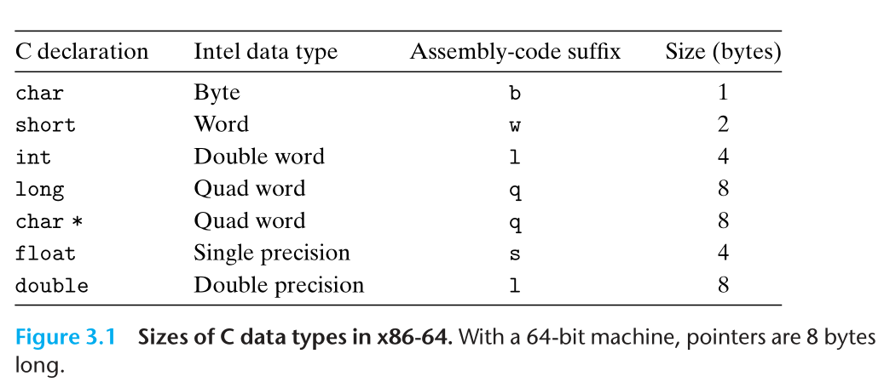
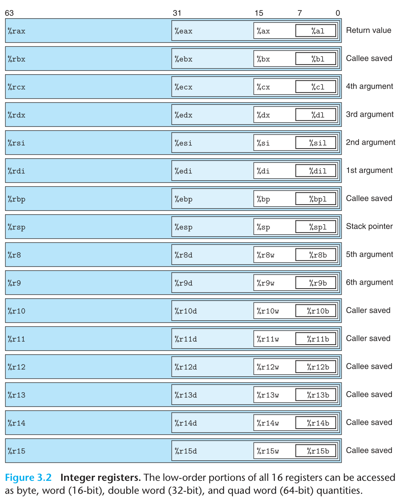
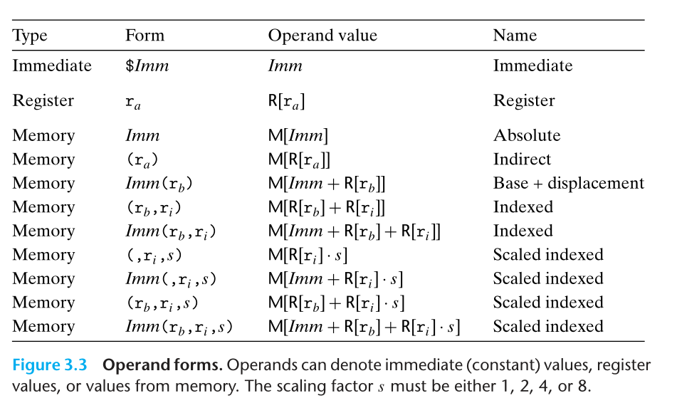
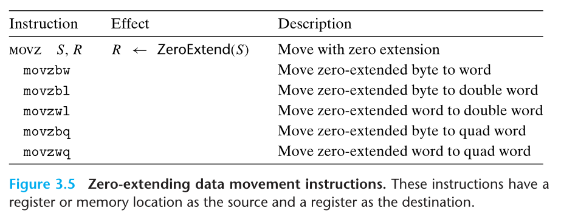
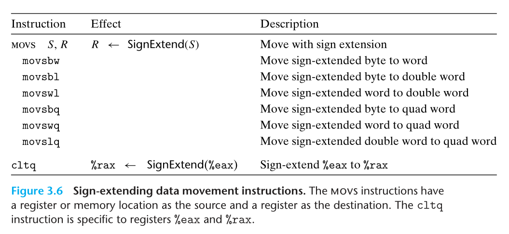
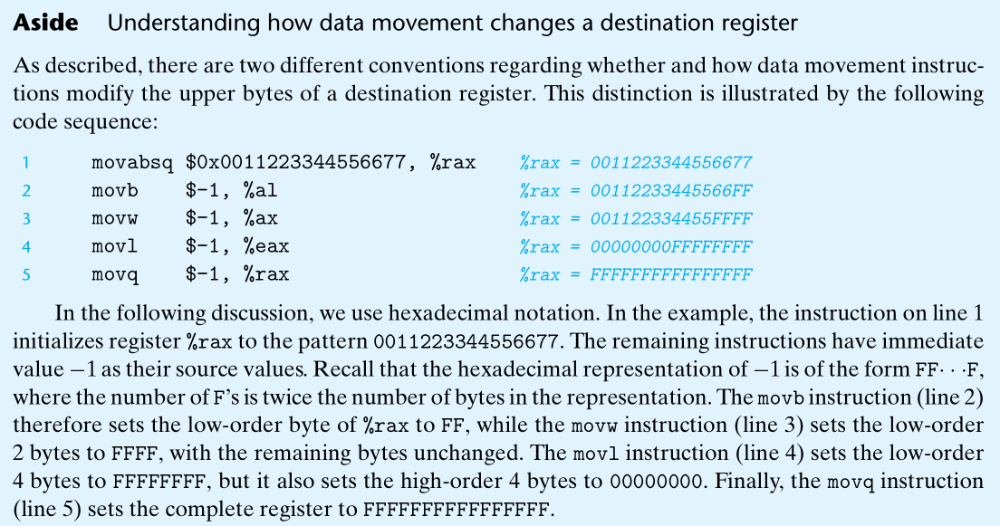
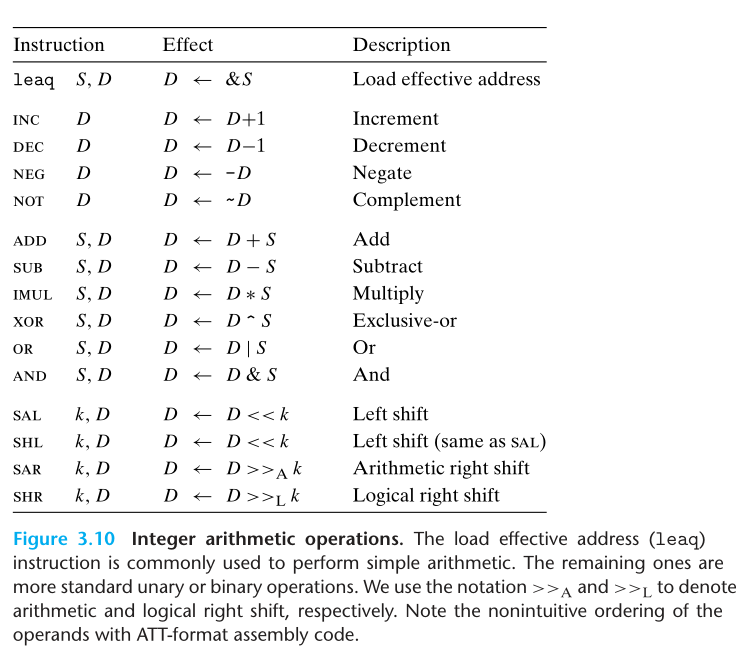

# 第三章

CS:APP 学习过程记录

文中的插图出自 Computer Systems: A Programmer's Perspective, 3/E (CS:APP3e). 版权归原作者所有.

#### 词汇汇总
- ISA(Instruction Set Architecture): 指令集架构. 定义了处理器的状态. 指令的格式. 指令对状态的影响.
- PC(Program counter): 程序计数器. 是寄存器中的一种. 表示当前正在执行的指令的地址.指示计算机在其程序序列中的位置.
- ASM(Assembly): 汇编

#### 两种汇编格式间的差异

相对于 ATT 汇编语法, 还有 Intel 语法.

- Intel 指令省略了汇编指令末尾指示指令操作数据大小的后缀.
- Intel 省略寄存器名字前的 `%`.
- Intel 指令如果有多个操作数, 比如 `mov rbx, rdx` 相对于 ATT 格式. `rbx, rdx` 的位置是调换过来的.
- Intel 描述内存中的位置的方式不同. Intel 的方式: `QWORD PTR [rbx]`. ATT 的方式: `(%rbx)`.

#### 如何在 C 中调用汇编

- 使用汇编器和链接器合并.
- 用 asm 伪指令, 通过 GCC 内联汇编(inline assembly) 实现.

#### 汇编指令中的后缀的含义

#### 常见整数寄存器作用概述

函数参数相关的寄存器:

- rdi: 第1个64bits类型参数
- rsi: 第2个64bits类型参数
- rdx: 第3个64bits类型参数
- rdc: 第4个64bits类型参数
- r8: 第5个64bits类型参数
- r9: 第6个64bits类型参数

PS: 编译器并不会严格遵守寄存器的名字及其对应的含义.

#### 精简指令集和复杂指令集的区别

- 在精简指令集(RISC)中, 寄存器是泛用的, 所有寄存器可用于所有内容, 以及编译器设计的单纯化(不过寄存器中区分了整数和浮点数).
- 在精简指令集(RISC)中, 单纯的寻址模式(复杂寻址模式以简单计算指令序列取代).
- 精简指令集(RISC)是统一指令编码的(例如，所有指令中的 op-code 永远位于同样的比特位置、等长指令), 可快速解译.

#### 如何读懂 ATT 汇编

汇编代码由指令和操作数组成.

指令的作用需要查询指令集的文档.

操作数表示指令的参数(如果类比指令为编程中的函数, 可以理解为操作数即为函数的参数). 有三种. 分别是:

- Immediate (立即数, 可以理解为常量)
- Register (寄存器值, 表示寄存器中的内容)
- memory reference (内存引用, 表示对应内存上的值)

这三种操作数(也就是指令的三类参数)的组合形式实现了丰富的取址模式(如果假设内存是一个数组, 那么, 取址可以理解为表示对应数据的索引). 从而实现对数组和结构体的取址.

下面是所有取址模式的截图:

#### 栈顶和栈底在虚拟地址空间里的特性

在虚拟地址空间. 栈底可以认为是栈的最小索引所在的一端. 栈顶表示的是数据插入和删除的这端. 栈顶的索引比栈底的小. 因此, 栈地址是从大到小表示的(逆向的). rsp 寄存器保存着最新的栈地址. 在虚拟地址空间, 栈可以看作以字节为单位后进先出的数组. rsp 寄存器存放着最新的索引. 如果栈内数据不满足后进先出的规定. 就逃逸到堆了.

#### mov 指令后缀与高位填充

如果一个 32 bits 的数据要移动到 64 bits 的寄存器. 那么就涉及到寄存器的高位如何填充的问题. 如果要默认填充为 0, 则指令末尾会有 `z` 后缀, 比如 `movzbw`. 如果要默认填充为符号位, 类似于算术右移的位填充原理, 则指令末尾会有 `s` 后缀, 比如 `movsbw`. 在刚才提到的两个例子中都有 `bw` 的后缀. 这个后缀的含义是:

`b` 表示 `movz` 指令的源数据的大小为一个字节, `w` 表示 `movz` 指令的目标可以存放的数据的大小是一个字(两个字节大小). 因此整个 `movzbw` 指令的含义是:

将源数据(一个字节大小)移动到目标地址(两个字节大小). 此时因为目标地址的大小较大, 多出来的高位(一个字节)填充为0(因为 mov 指令后面的 z).

PS:

x86-64 惯例, 任何为寄存器生成 32 bits 值的指令, 都会把高位(32 bits)置为0.

对比上面的两张图可以看到. 高位零填充下的指令是没有 `movzlq` 这条的. 这就是惯例的意义. 因为惯例已经覆盖了这个情况. 其他情况下. 如果没有指明高位是 0 填充还是 1 填充时, 默认就是不做任何填充, 保留原来的值. 书中的解释非常清楚:

GCC 生成的汇编代码是有指示大小的后缀的. 但是反汇编器反汇编生成的汇编代码是没有这些指示大小的后缀的. (在当前文档的文件夹内有一份 `mstore.o` 文件, 你可以通过 `objdump -d mstore.o` 对比着 `mstore.s` 文件可以看出来)

#### 机器代码如何实现算术运算

机器代码有相关的算术指令比如:

PS:
- 关于乘法:
  - 乘法分为无符号乘法(mul)和补码乘法(imul).
  - 乘法有两种操作数形式(单操作数和双操作数).
  - 单操作数默认参数有一个一定在 rax 寄存器内, 另外一个参数为指令提供的源操作数, 从而实现两个 64 位整数的乘法(结果为 128 bits). 结果的低 64 位放在 rax 寄存器, 高 64 位放在 rdx 寄存器.
- 关于除法和取模操作:
  - 由单操作数除法指令(idiv/div)来实现, rdx(高 64 位) 和 rax(低 64 位) 寄存器共同组成 128 bits 的被除数, 指令提供的源操作数作为除数. 商存放在 rax 寄存器, 余数存储在 rdx 寄存器内.
  - cqto 指令读出 rax 的符号位, 并将它复制到 rdx 的所有位, 实现有符号数的符号位初始化.

- 为什么 xorq %rdx %rdx 和 movl $0 %edx 可以实现置 0 效果
  - 前者: 因为 0 ^ 0 = 0
  - 后者: 因为 x86-64 有如下规定, 当出现 32 寄存器的写操作时, 寄存器的高 32 位会被置0.
