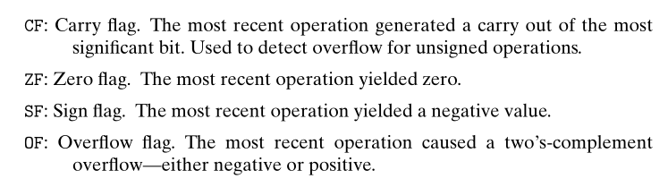
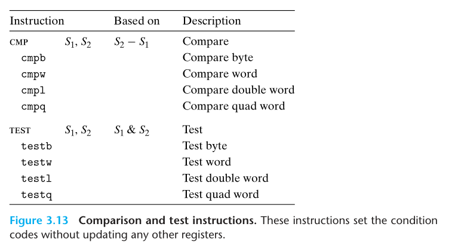
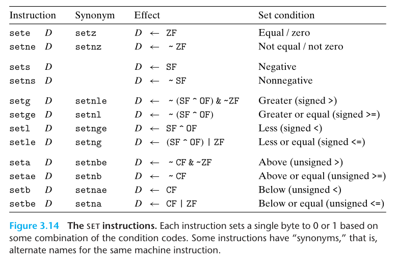
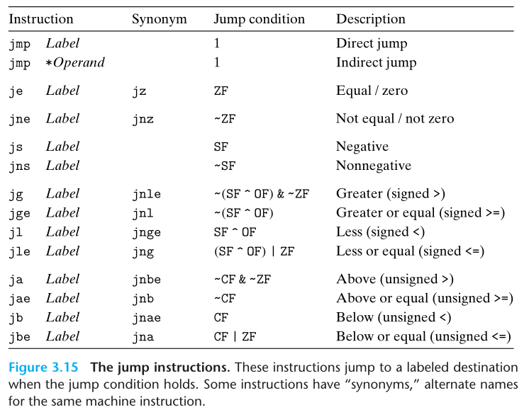

# 第三章

CS:APP 学习过程记录

文中的插图出自 Computer Systems: A Programmer's Perspective, 3/E (CS:APP3e). 版权归原作者所有.

#### 目录

<!-- vim-markdown-toc GFM -->

* [词汇汇总](#词汇汇总)
* [两种汇编格式间的差异](#两种汇编格式间的差异)
* [如何在 C 中调用汇编](#如何在-c-中调用汇编)
* [汇编指令中的后缀的含义](#汇编指令中的后缀的含义)
* [常见整数寄存器作用概述](#常见整数寄存器作用概述)
* [精简指令集和复杂指令集的区别](#精简指令集和复杂指令集的区别)
* [如何读懂 ATT 汇编](#如何读懂-att-汇编)
* [栈顶和栈底在虚拟地址空间里的特性](#栈顶和栈底在虚拟地址空间里的特性)
* [mov 指令后缀与高位填充](#mov-指令后缀与高位填充)
* [机器代码如何实现算术运算](#机器代码如何实现算术运算)
* [机器代码如何实现流程控制](#机器代码如何实现流程控制)
* [golang 多返回值](#golang-多返回值)
* [机器代码如何实现循环](#机器代码如何实现循环)
* [机器代码如何实现多重分支](#机器代码如何实现多重分支)
* [如何实现 C 多重分支(Switch)](#如何实现-c-多重分支switch)
* [golang 如何处理参数](#golang-如何处理参数)
* [如何判断 IP 是否属于一个网段](#如何判断-ip-是否属于一个网段)
* [递归的思路](#递归的思路)
* [复合结构为什么需要进行内存重排](#复合结构为什么需要进行内存重排)
* [汇编如何实现可变参数的函数](#汇编如何实现可变参数的函数)
* [SIMD 有什么用](#simd-有什么用)
* [SIMD 如何实现这个作用的](#simd-如何实现这个作用的)
* [锁和原子性是通过什么指令实现的](#锁和原子性是通过什么指令实现的)
* [CPU 如何做上下文切换](#cpu-如何做上下文切换)
* [为什么线程切换比进程切换更快](#为什么线程切换比进程切换更快)
* [PCB 存放在哪里](#pcb-存放在哪里)
* [CPU 如何访问和管理内存](#cpu-如何访问和管理内存)
* [FAQ:](#faq)
* [参考](#参考)

<!-- vim-markdown-toc -->

#### 词汇汇总
- ISA(Instruction Set Architecture): 指令集架构. 定义了处理器的状态. 指令的格式. 指令对状态的影响.
- PC(Program Counter): 程序计数器. 是寄存器中的一种. 表示当前正在执行的指令的地址.指示计算机在其程序序列中的位置. 在过程调用中, 通过改变 PC 寄存器的地址. 可以实现调用和函数返回的逻辑.
- ASM(Assembly): 汇编
- PCB(Process Control Block): also known as a process descriptor. 用于存储进程的上下文信息. 最终保存到指定的内存区域.
- SIMD(Single instruction, multiple data): 是一种分类(描述的这个分类的功能), 可以实现一条指令同时处理多个数据.
- SSE(Streaming SIMD Extensions): 是一套指令集. 含70条新指令, 这些指令具备 SIMD 特性.
- AVX(Advanced Vector Extensions): SSE 升级版, 比如: AVX AVX2 AVX-512.
- XMM registers: 用于 SSE 的寄存器. 128 bits.
- YMM registers: 用于 AVX 的寄存器. 256 bits.
- ZMM registers: 用于 AVX-512 的寄存器. 512 bits.
- Memory barrier: 内存屏障(内存栅栏). 用于实现并发变成里面的锁, 确保并发编程中内存读写的一致性.
- MMU(Memory Management Unit): 用于 CPU 实现内存虚拟地址到物理地址映射的转换.
- IOMMU(Input–Output Memory Management Unit): 用于连接具备直接访问内存能力的 I/O 总线设备到内存, 实现 I/O 设备直接访问内存的能力(本质上也是实现虚拟内存地址到物理地址映射的功能). 比如 PCIe 显卡的 graphics address remapping table(GART).
- PTE(Page Table Entry): todo
- TLB(Translation Lookaside Buffer): todo
- TSS(task state segment): todo
- GDT(global descriptor table): todo
- LDT(local descriptor table): todo
- TR(task register): todo
- IDT/IVT(interrupt descriptor table): In the 8086 processor, the interrupt table is called IVT (interrupt vector table). 包含了 interrupt 到 ISR 的映射.
- ISR(interrupt service routine): is a special block of code associated with a specific interrupt condition. such as system call.

#### 两种汇编格式间的差异

相对于 ATT 汇编语法, 还有 Intel 语法.

- Intel 指令省略了汇编指令末尾指示指令操作数据大小的后缀.
- Intel 省略寄存器名字前的 `%`.
- Intel 指令如果有多个操作数, 比如 `mov rbx, rdx` 相对于 ATT 格式. `rbx, rdx` 的位置是调换过来的.
- Intel 描述内存中的位置的方式不同. Intel 的方式: `QWORD PTR [rbx]`. ATT 的方式: `(%rbx)`.

#### 如何在 C 中调用汇编

- 使用汇编器和链接器合并.
- 用 asm 伪指令, 通过 GCC 内联汇编(inline assembly) 实现.

#### 汇编指令中的后缀的含义


#### 常见整数寄存器作用概述


函数参数相关的寄存器:

- rdi: 第1个64bits类型参数
- rsi: 第2个64bits类型参数
- rdx: 第3个64bits类型参数
- rdc: 第4个64bits类型参数
- r8: 第5个64bits类型参数
- r9: 第6个64bits类型参数

PS: 编译器并不会严格遵守寄存器的名字及其对应的含义.

#### 精简指令集和复杂指令集的区别

- 在精简指令集(RISC)中, 寄存器是泛用的, 所有寄存器可用于所有内容, 以及编译器设计的单纯化(不过寄存器中区分了整数和浮点数).
- 在精简指令集(RISC)中, 单纯的寻址模式(复杂寻址模式以简单计算指令序列取代).
- 精简指令集(RISC)是统一指令编码的(例如，所有指令中的 op-code 永远位于同样的比特位置、等长指令), 可快速解译.

#### 如何读懂 ATT 汇编

汇编代码由指令和操作数组成.

指令的作用需要查询指令集的文档.

操作数表示指令的参数(如果类比指令为编程中的函数, 可以理解为操作数即为函数的参数). 有三种. 分别是:

- Immediate (立即数, 可以理解为常量)
- Register (寄存器值, 表示寄存器中的内容)
- memory reference (内存引用, 表示对应内存上的值)

这三种操作数(也就是指令的三类参数)的组合形式实现了丰富的取址模式(如果假设内存是一个数组, 那么, 取址可以理解为表示对应数据的索引). 从而实现对数组和结构体的取址.

下面是所有取址模式的截图:


#### 栈顶和栈底在虚拟地址空间里的特性

在虚拟地址空间. 栈底可以认为是栈的最小索引所在的一端. 栈顶表示的是数据插入和删除的这端. 栈顶的索引比栈底的小. 因此, 栈地址是从大到小表示的(逆向的). rsp 寄存器保存着最新的栈地址. 在虚拟地址空间, 栈可以看作以字节为单位后进先出的数组. rsp 寄存器存放着最新的索引. 如果栈内数据不满足后进先出的规定. 就逃逸到堆了.

#### mov 指令后缀与高位填充

如果一个 32 bits 的数据要移动到 64 bits 的寄存器. 那么就涉及到寄存器的高位如何填充的问题. 如果要默认填充为 0, 则指令末尾会有 `z` 后缀, 比如 `movzbw`. 如果要默认填充为符号位, 类似于算术右移的位填充原理, 则指令末尾会有 `s` 后缀, 比如 `movsbw`. 在刚才提到的两个例子中都有 `bw` 的后缀. 这个后缀的含义是:

`b` 表示 `movz` 指令的源数据的大小为一个字节, `w` 表示 `movz` 指令的目标可以存放的数据的大小是一个字(两个字节大小). 因此整个 `movzbw` 指令的含义是:

将源数据(一个字节大小)移动到目标地址(两个字节大小). 此时因为目标地址的大小较大, 多出来的高位(一个字节)填充为0(因为 mov 指令后面的 z).

PS:

x86-64 惯例, 任何为寄存器生成 32 bits 值的指令, 都会把高位(32 bits)置为0.


对比上面的两张图可以看到. 高位零填充下的指令是没有 `movzlq` 这条的. 这就是惯例的意义. 因为惯例已经覆盖了这个情况. 其他情况下. 如果没有指明高位是 0 填充还是 1 填充时, 默认就是不做任何填充, 保留原来的值. 书中的解释非常清楚:


GCC 生成的汇编代码是有指示大小的后缀的. 但是反汇编器反汇编生成的汇编代码是没有这些指示大小的后缀的. (在当前文档的文件夹内有一份 `mstore.o` 文件, 你可以通过 `objdump -d mstore.o` 对比着 `mstore.s` 文件可以看出来)

#### 机器代码如何实现算术运算

机器代码有相关的算术指令比如:


PS:
- 关于乘法:
  - 乘法分为无符号乘法(mul)和补码乘法(imul).
  - 乘法有两种操作数形式(单操作数和双操作数).
  - 单操作数默认参数有一个一定在 rax 寄存器内, 另外一个参数为指令提供的源操作数, 从而实现两个 64 位整数的乘法(结果为 128 bits). 结果的低 64 位放在 rax 寄存器, 高 64 位放在 rdx 寄存器.
- 关于除法和取模操作:
  - 由单操作数除法指令(idiv/div)来实现, rdx(高 64 位) 和 rax(低 64 位) 寄存器共同组成 128 bits 的被除数, 指令提供的源操作数作为除数. 商存放在 rax 寄存器, 余数存储在 rdx 寄存器内.
  - cqto 指令读出 rax 的符号位, 并将它复制到 rdx 的所有位, 实现有符号数的符号位初始化.

- 为什么 xorq %rdx %rdx 和 movl $0 %edx 可以实现置 0 效果
  - 前者: 因为 0 ^ 0 = 0
  - 后者: 因为 x86-64 有如下规定, 当出现 32 寄存器的写操作时, 寄存器的高 32 位会被置0.

#### 机器代码如何实现流程控制

条件码寄存器: 描述最近的算术指令或者逻辑指令的属性的寄存器(寄存器上的每个二进制位, 表示一种状态, 我们叫这些比特位为条件码, 条件码被置为0或者1时, 表示对应的两种状态).

条件码寄存器(寄存器名字: FLAGS)有 16 bits. 在保证标志位兼容的情况下(条件寄存器的第几个比特位表示特定的含义, 这个位置关系不变), 还有 EFLAGS (32 bits) 条件码寄存器, RFLAGS (64 bits) 寄存器.

条件码和对应的含义(这里只讨论4个使用最频繁的条件码):



标志寄存器会被一些逻辑类的指令, 比如 cmp 和 test 用到. 比如在 test 指令下, 多个标志位的**组合使用**, 可以判断一个寄存器里面的值是正数还是负数还是0.

下面概述一下几个常见的标志位
- CF: 进位标识符. 发生算术运算上的进位或者减法的被减数借位时. 标志位会被置为 1. <!-- todo: 需要更进一步的查看文档 -->
- ZF: 零标识符. 可以认为是目标操作数减去源操作数(sub 指令, 但得到的结果不会保存到目标操作数中, 只更新标志位). 如果差值位0, 则 ZF 会被置为1. 反之亦然.(有些指令不是做减法, 而是做逻辑 AND).
- SF: 符号位标识符. 如果符号位的 AND 结果位0, 则 SF 标志位会被置位1. 反之亦然.
- OF: 溢出标识符. 符号位如果发生了变化. OF 被置为 1. 反之亦然.

PS:

- 除了 leaq 指令, 其他的算术指令都会更新条件码寄存器.
- cmp 和 test 类指令只设置条件码寄存器, 但不会更新目的寄存器里面的内容.
  - cmp 用于比较, 根据两个操作数之差, 如果两个操作数相等, ZF 置为 1. 否则 ZF 为 0. 其他标置为用于记录大小关系.
  - test 用于类似与 AND. 只是不会更新目的寄存器里面的内容.



set 类指令:



jump 类指令:



Q: 汇编如何判断一个数是正数, 负数, 0?

A:

- TEST %rcx %rcx
- 正数
  - 符号位 AND 结果位 0. SF 位 1.
- 负数
  - 符号位 AND 结果位 1. SF 位 0.
- 0
  - 做 `%rcx AND %rcx` 的操作. 算术结果为 0. ZF 位 1. 因此, ZF 为 1 时 `TEST %rcx %rcx` 为 0.

#### golang 多返回值

```bash
go build --gcflags '-N -L' multiple-return-values.go
gdb multiple-return-values

# 在 gdb shell 内执行
# break multiple-return-values.go:16
# run
# layout split
```

golang 不像 c. golang 支持多返回值. 返回值被保存在调用方的栈内.

#### 机器代码如何实现循环

do while loop 实现:

```asm
	.file	"pcount_do.c"
	.text
	.globl	pcount_do
	.type	pcount_do, @function
pcount_do:
.LFB0:
	.cfi_startproc
	movl	$0, %eax
.L2:
	movq	%rdi, %rdx
	andl	$1, %edx
	addq	%rdx, %rax
	shrq	%rdi
	jne	.L2
	ret
	.cfi_endproc
.LFE0:
	.size	pcount_do, .-pcount_do
	.ident	"GCC: (GNU) 10.2.0"
	.section	.note.GNU-stack,"",@progbits
```

可以看到. 这里通过 `.L2` 和 `jne` 指令实现了循环跳转. 通过判断 `shrq` 指令的结果是否设置了 `ZF` 来解决是否退出循环. 如果 `shrq` 计算结果为 0. 此时 `ZF` 表示为 1. 不满足 `jne` 指令的执行条件(执行条件是: ZF=0. 见末尾intel的参考文档). 就退出循环了.


for loop 实现:

```asm
	.file	"pcount_for.c"
	.text
	.globl	pcount_for
	.type	pcount_for, @function
pcount_for:
.LFB0:
	.cfi_startproc
	movl	$0, %edx
	movl	$0, %ecx
	jmp	.L2
.L3:
	movq	%rdi, %rax
	shrq	%cl, %rax
	andl	$1, %eax
	addq	%rax, %rdx
	addq	$1, %rcx
.L2:
	cmpq	$31, %rcx
	jbe	.L3
	movq	%rdx, %rax
	ret
	.cfi_endproc
.LFE0:
	.size	pcount_for, .-pcount_for
	.ident	"GCC: (GNU) 10.2.0"
	.section	.note.GNU-stack,"",@progbits

```

while loop 实现:

```asm
	.file	"pcount_while.c"
	.text
	.globl	pcount_while
	.type	pcount_while, @function
pcount_while:
.LFB0:
	.cfi_startproc
	movl	$0, %eax
	jmp	.L2
.L3:
	movq	%rdi, %rdx
	andl	$1, %edx
	addq	%rdx, %rax
	shrq	%rdi
.L2:
	testq	%rdi, %rdi
	jne	.L3
	ret
	.cfi_endproc
.LFE0:
	.size	pcount_while, .-pcount_while
	.ident	"GCC: (GNU) 10.2.0"
	.section	.note.GNU-stack,"",@progbits
```

这是对 while loop 的解析: 为了实现类似先判断再执行代码的逻辑. 相对 do while loop 多加了一个跳转. 也就是 `jmp .L2`. 并在 `.L2` 标号内实现了判断. 如果 `%rdi` 的值不为0. 则 `testq` 就不会设置 `ZF` 为 1. `ZF` 的值就为默认的 0. `jne` 在 `ZF` 为 0 时满足条件. 因此会跳到 `.L3`. 实现循环.

for loop 本质上跟 while loop 是一样的. 只是初始条件. 判断条件. 更新条件. 逻辑代码主体在 c 代码中的风格(以及位置)不同而已.

#### 机器代码如何实现多重分支

方案1(只用于简单计算):

使用 CMOVcc 指令. CMOVcc 指令全程是 Conditional Move 指令. 思路是把所有分支的代码都执行一遍. 然后在末尾做一次条件判断和 CMOVcc. 通过条件判断. 从而确定返回值对应的寄存器, 应该存入那个值.

<!-- todo: 添加 demo code -->

方案2(常用方案):

通过 Jcc 系列指令和标号(LABEL). 通过标号标记一段指令的结束和另外一段指令的开始. 然后条件判断指令和 Jcc 实现有条件的跳转.

<!-- todo: 添加 demo code -->

#### 如何实现 C 多重分支(Switch)

switch 有两种实现思路. 一种是按照线性的方式. 这适用于分散的 case 的比较, 可以理解为多个 if-else 的组合. 另外一种是通过跳转表. 跳转表可以实现 O(1) 的复杂度的 case 查找. 但前提是需要 case 的数据是连续而密集. 从而避免过度的空间开销.

<!-- todo: jump table 原理 -->

#### golang 如何处理参数

参数存放到调用者的栈上, 以相对于 %rsp 的内存取址方式来访问

```gdb
gdb multiple-arguments

# 在 gdb shell 内执行
# break main.main
# run
# layout split
# nexti
```

#### 如何判断 IP 是否属于一个网段

假设:
- 网段是: 10.0.0.1/27
- IP 是: 10.0.0.21

1. 10.0.0.1 解析字符串为 32位无符号整数 a(二进制格式)
2. 生成 27 为掩码的32位无符号整数 m(二进制格式)
3. 做a AND m得到一个32位无符号整数 r1(二进制格式)
4. 解析 10.0.0.21 字符串为32位无符号整数 b(二进制格式)
5. 做b AND m得到一个32位无符号整数 r2(二进制格式)
6. 做 r1 XOR r2. 如果结果为 0. CPU 状态寄存器的 ZF 置 1. 此时, CPU 只要判断该寄存器的 ZF 位是否为 1, 既可确定 b 对应的IP是否属于该网段.

#### 递归的思路

<!-- todo -->

#### 复合结构为什么需要进行内存重排

<!-- todo -->

#### 汇编如何实现可变参数的函数

<!-- todo -->

#### SIMD 有什么用

<!-- todo -->

#### SIMD 如何实现这个作用的

<!-- todo -->

#### 锁和原子性是通过什么指令实现的

在 x86-64 中存在内存屏障类的指令, 如下:

- lfense: load fence. 只针对 load-from-memory 操作相关的指令, 确保在这个指令之前的所有 load-from-memory 操作相关的指令都结束后, 才能执行 lfense 这个指令, 并确保 lfense 指令结束后, 后面的 load-from-memory 操作相关的指令才会被执行.
- sfense: store fence. 只针对 store-to-memory 操作相关的指令, 确保 sfence 指令之前的所有 store-to-memory 指令对应的数据已经是 globally visible 的了(可以理解为已经写入内存). 然后才能执行 sfence 后面任何 store-to-memory 相关的指令(换句话说, sfence 只对 store-to-memory 操作相关的指令生效).
- mfense: memory fence. 对所有 load-from-memory 和 store-to-memory 操作相关的指令有效. 相当于同时使用前面两个指令.

这些指令的作用. 可以在 intel 提供的指令文档内找到(见: reference).

#### CPU 如何做上下文切换

为了实现并发效果. CPU 会通过上下文切换, 实现不同的进程同时运行的假象. 旧进程的状态会被保存为 PCB(并存放到特定的内存区域), 这里保存的信息包括通用寄存器中的数据, 特殊寄存器(比如 SP BP AX 等特殊寄存器)中的数据, PC (program counter) 中的数据, 内存地址空间中的数据等. 然后从 ready queue 里面选择下一个需要执行的进程, 加载该进程的 PCB.

#### 为什么线程切换比进程切换更快

因为线程是复用进程的内存地址空间的. 而不同的进程, 内存地址空间是不同的. 进程切换需要将内存地址空间内的数据保存到 PCB. 而线程切换, 因为复用的是同一个进程的内存地址空间, 减少了内存操作, 更轻巧. 成本更低, 所以更快.

#### PCB 存放在哪里

存放到了指定的内存区域. 该区域可以是内核指定的. 也可以是系统指定的.

#### CPU 如何访问和管理内存

<!-- todo -->

#### FAQ:

Q: 如何查阅指令文档.

A: AMD & Intel 二者都提供了 ISA 的文档. 见参考. 可以在 TOC 内找到指令后跳转即可.

Q: `leaq 8(%rsp) %rdi` 表示的含义

A: leaq 类似于 C 中的 `&` 符号. 这里的作用是将 `8(%rsp)` 的地址存到 %rdi.

#### 参考
- [条件码寄存器-维基百科](https://en.wikipedia.org/wiki/FLAGS_register)
- [Intel ISA reference](https://software.intel.com/content/dam/develop/public/us/en/documents/325462-sdm-vol-1-2abcd-3abcd.pdf)
- [AMD ISA reference](https://www.amd.com/system/files/TechDocs/40332.pdf)
- [德州大學 James Bornholt: 内存模型](https://www.cs.utexas.edu/~bornholt/post/memory-models.html)
- [饶全成: 曹大谈内存重排](https://qcrao.com/2019/06/17/cch-says-memory-reorder/)
- [Streaming SIMD Extensions](https://en.wikipedia.org/wiki/Streaming_SIMD_Extensions)
- [Advanced Vector Extensions SIMD](https://en.wikipedia.org/wiki/AVX-512)
- [CPU context switch](https://en.wikipedia.org/wiki/Context_switch)
- [breaking though the maximum process number](https://www.linuxjournal.com/article/4407)
- [Streaming SIMD Extensions](https://en.wikipedia.org/wiki/Streaming_SIMD_Extensions)
- [Memory Management Unit](https://en.wikipedia.org/wiki/Memory_management_unit)
