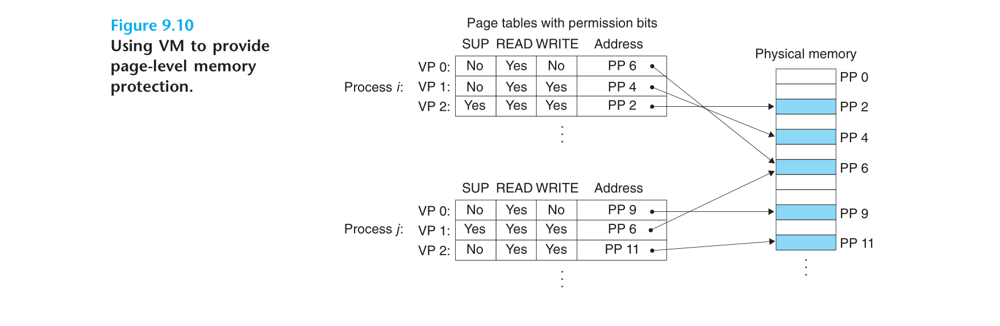
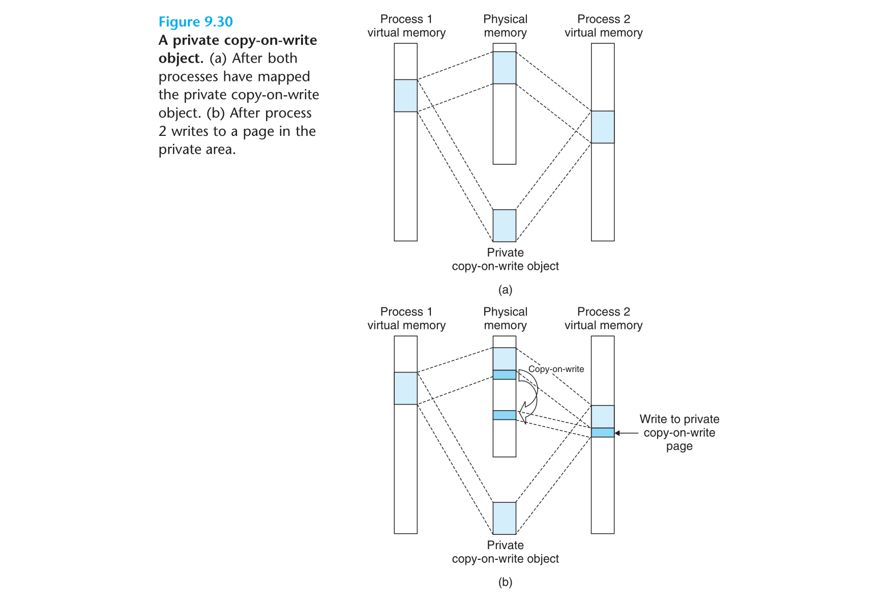

# 第七章和第八章

CS:APP 学习过程记录

文中的插图出自 Computer Systems: A Programmer's Perspective, 3/E (CS:APP3e). 版权归原作者所有.

#### 目录
<!-- vim-markdown-toc GFM -->

* [这一章的学习目标](#这一章的学习目标)
* [为什么要学习链接器](#为什么要学习链接器)
* [可重定向目标文件的格式和对应节的作用](#可重定向目标文件的格式和对应节的作用)
* [如何生成可重定位对象文件](#如何生成可重定位对象文件)
* [可重定位文件如何重定位](#可重定位文件如何重定位)
* [如何编译静态库](#如何编译静态库)
* [如何编译动态库](#如何编译动态库)
* [如何加载二进制文件](#如何加载二进制文件)
* [如何加载和链接静态库](#如何加载和链接静态库)
* [如何加载和链接动态库](#如何加载和链接动态库)
* [库插入(library interposition/库打桩)是什么](#库插入library-interposition库打桩是什么)
* [库插入(library interposition/库打桩)的作用](#库插入library-interposition库打桩的作用)
* [PIC GOT PLT 和链接器的作用](#pic-got-plt-和链接器的作用)
* [第六章Tips](#第六章tips)
  * [GNU binutils 包中的工具和对应的作用(这些工具很棒, 建议实际使用一下这些工具)](#gnu-binutils-包中的工具和对应的作用这些工具很棒-建议实际使用一下这些工具)
  * [ar 的基本用法](#ar-的基本用法)
  * [strings 的基本用法](#strings-的基本用法)
  * [strip 的基本用法](#strip-的基本用法)
  * [nm 的基本用法](#nm-的基本用法)
  * [size 的基本用法](#size-的基本用法)
  * [readelf 的基本用法](#readelf-的基本用法)
  * [objdump 的基本用法](#objdump-的基本用法)
  * [ldd 的基本用法](#ldd-的基本用法)
* [四类中断的含义](#四类中断的含义)
* [x86-64中断相关的寄存器](#x86-64中断相关的寄存器)
* [汇编进行系统调用](#汇编进行系统调用)
* [C 如何实现多进程](#c-如何实现多进程)
* [fork 和 execute 系统调用的差异](#fork-和-execute-系统调用的差异)
* [如何给目的进程传递信号](#如何给目的进程传递信号)
* [什么是阻塞式信号和非阻塞式信号, 有何作用](#什么是阻塞式信号和非阻塞式信号-有何作用)
* [如何查看和发送信号给进程组](#如何查看和发送信号给进程组)
* [并发编程的基本原则](#并发编程的基本原则)
* [如何清理 zombie 进程](#如何清理-zombie-进程)
* [书中说到的竞争的例子是如何产生的](#书中说到的竞争的例子是如何产生的)
* [什么是非本地跳转, 作用是什么, 潜在的问题](#什么是非本地跳转-作用是什么-潜在的问题)
* [操作进程的常用工具, 有何作用, 如何使用](#操作进程的常用工具-有何作用-如何使用)
* [PID PGID UID SID 各自代表的信息和作用](#pid-pgid-uid-sid-各自代表的信息和作用)
* [虚拟内存如何保护物理内存](#虚拟内存如何保护物理内存)
* [MMU 作用](#mmu-作用)
* [TLB 的作用](#tlb-的作用)
* [虚拟内存共享对象的作用](#虚拟内存共享对象的作用)
* [写时复制在私有对象上的作用](#写时复制在私有对象上的作用)
* [词汇汇总](#词汇汇总)
* [参考文档](#参考文档)

<!-- vim-markdown-toc -->
#### 这一章的学习目标

- 二进制是如何组织的?
- 如何分析二进制文件?
- 收益是什么?

#### 为什么要学习链接器

todo: 明确学习这一章的收益

#### 可重定向目标文件的格式和对应节的作用

todo: 确保自己可以看懂 `readelf` 的输出

#### 如何生成可重定位对象文件

todo: 提供一个 demo

#### 可重定位文件如何重定位

todo: 概述出来, 确保自己知道

#### 如何编译静态库

todo: 提供一个 demo

#### 如何编译动态库

todo: 提供一个 demo

#### 如何加载二进制文件

todo: 明白一个可执行二进制是如何被执行的

#### 如何加载和链接静态库

todo: 知道如何加载和链接, 避免今后对加载和链接相关的基础错误的陌生感.

#### 如何加载和链接动态库

todo: 知道如何加载和链接, 避免今后对加载和链接相关的基础错误的陌生感.

#### 库插入(library interposition/库打桩)是什么

在可执行程序加载时, 替换一个库为另外的一个库. 因此, 我们可以截获一个对共享库的调用, 取而代之, 执行自己的代码.

#### 库插入(library interposition/库打桩)的作用

- 统计对某个库函数的调用次数
- 验证和追踪库函数的输入输出值
- 替换库函数, 验证一个自己实现的库函数

#### PIC GOT PLT 和链接器的作用

todo: 链接静态库和动态库是机器代码中常见. 见参考

#### 第六章Tips

##### GNU binutils 包中的工具和对应的作用(这些工具很棒, 建议实际使用一下这些工具)

- `ar`: Creates static libraries, and inserts, deletes, lists, and extracts members.
- `strings`: Lists all of the printable strings contained in an object file.
- `strip`: Deletes symbol table information from an object file.
- `nm`: Lists the symbols defined in the symbol table of an object file.
- `size`: Lists the names and sizes of the sections in an object file.
- `readelf`: Displays the complete structure of an object file, including all of the information encoded in the ELF header. Subsumes the functionality of size and nm.
- `objdump`: The mother of all binary tools. Can display all of the information in an object file. Its most useful function is disassembling the binary instructions in the .text section.

Linux系统还提供用于操作共享库的 ldd 程序：

- `ldd`: Lists the shared libraries that an executable needs at run time.

##### ar 的基本用法

```
ar

Create, modify, and extract from archives (.a, .so, .o).

- Extract all members from an archive:
  ar -x libfoo.a

- List the members of an archive:
  ar -t libfoo.a

- Replace or add files to an archive:
  ar -r libfoo.a foo.o bar.o baz.o

- Insert an object file index (equivalent to using `ranlib`):
  ar -s libfoo.a

- Create an archive with files and an accompanying object file index:
  ar -rs libfoo.a foo.o bar.o baz.o
```

输出:

```
➜ ar -t /usr/lib/libc.a | head
init-first.o
libc-start.o
sysdep.o
version.o
check_fds.o
libc-tls.o
elf-init.o
dso_handle.o
errno.o
errno-loc.o
...内容太多, 省略
```

列出了 libc.a 中的部分成员

##### strings 的基本用法

```
strings

Find printable strings in an object file or binary.

- Print all strings in a binary:
  strings file

- Limit results to strings at least *length* characters long:
  strings -n length file

- Prefix each result with its offset within the file:
  strings -t d file

- Prefix each result with its offset within the file in hexadecimal:
  strings -t x file
```

##### strip 的基本用法

输出:

```
todo: 需要后面补充
```

##### nm 的基本用法

```
nm

List symbol names in object files.

- List global (extern) functions in a file (prefixed with T):
  nm -g file.o

- List only undefined symbols in a file:
  nm -u file.o

- List all symbols, even debugging symbols:
  nm -a file.o

- Demangle C++ symbols (make them readable):
  nm --demangle file.o
```

输出:

```
➜ nm -g mountain
00000000004021e0 T access_counter
00000000004010c0 T add_sample
0000000000604098 A __bss_start
                 U calloc@@GLIBC_2.2.5
...内容太多, 省略
0000000000604098 D __TMC_END__
```

##### size 的基本用法

输出:

```
➜  size ~/go/bin/lego
text             data    bss    dec             hex     filename
31700229         478736  212480 32391445        1ee4115 /home/jinmiaoluo/go/bin/lego
```

##### readelf 的基本用法

```
readelf

Displays information about ELF files.
More information: http://man7.org/linux/man-pages/man1/readelf.1.html.

- Display all information about the ELF file:
  readelf -all path/to/binary

- Display all the headers present in the ELF file:
  readelf --headers path/to/binary

- Display the entries in symbol table section of the ELF file, if it has one:
  readelf --symbols path/to/binary

- Display the information contained in the ELF header at the start of the file:
  readelf --file-header path/to/binary
```

输出:

```
➜ readelf --all /bin/ls
ELF Header:
  ...内容太多, 省略
Section Headers:
  ...内容太多, 省略
Key to Flags:
  ...内容太多, 省略
Program Headers:
  ...内容太多, 省略
Dynamic section at offset 0x21a58 contains 28 entries:
  ...内容太多, 省略
Relocation section '.rela.dyn' at offset 0x16f8 contains 320 entries:
  ...内容太多, 省略
Relocation section '.rela.plt' at offset 0x34f8 contains 1 entry:
  ...内容太多, 省略
Symbol table '.dynsym' contains 128 entries:
  ...内容太多, 省略
Histogram for '.gnu.hash' bucket list length (total of 21 buckets):
  ...内容太多, 省略
Version symbols section '.gnu.version' contains 128 entries:
  ...内容太多, 省略
Version needs section '.gnu.version_r' contains 1 entry:
  ...内容太多, 省略
Displaying notes found in: .note.gnu.build-id
  ...内容太多, 省略
Displaying notes found in: .note.ABI-tag
  ...内容太多, 省略
```

##### objdump 的基本用法

```
objdump

View information about object files.

- Display the file header information:
  objdump -f binary

- Display the dis-assembled output of executable sections:
  objdump -d binary

- Display a complete binary hex dump of all sections:
  objdump -s binary
```

输出:

```
➜ objdump -f /bin/ls

/bin/ls:     file format elf64-x86-64
architecture: i386:x86-64, flags 0x00000150:
HAS_SYMS, DYNAMIC, D_PAGED
start address 0x0000000000005b20
```

另外, 常用于查看二进制文件各节的十六进制表示. 也可以将二进制反编译成汇编代码.

##### ldd 的基本用法

```
ldd

Display shared library dependencies.

- Display shared library dependencies of a binary:
  ldd path/to/binary

- Display unused direct dependencies:
  ldd -u path/to/binary
```

输出(这里以 ACME 客户端 lego 为例):

```
➜  ldd ~/go/bin/lego
linux-vdso.so.1 (0x00007ffc837fd000)
libpthread.so.0 => /usr/lib/libpthread.so.0 (0x00007f50ae146000)
libc.so.6 => /usr/lib/libc.so.6 (0x00007f50adf7d000)
/lib64/ld-linux-x86-64.so.2 => /usr/lib64/ld-linux-x86-64.so.2 (0x00007f50ae196000)
```

可以看到它依赖了4个动态库.

#### 四类中断的含义

todo: 这四种异常的原因(区别). 发生这种异常时, 系统是如何应对的. 这是了解中断作用的基础.

- Interrupt: 中断.
- Trap: 陷阱.
- Fault: 错误.
- Abort: 中止.

如何处理中断:

如何处理陷阱:

如何处理错误:

如何处理中止:

#### x86-64中断相关的寄存器

todo: 记录中断相关寄存器的作用. 这是了解汇编如何实现自己的中断处理函数的基础.

#### 汇编进行系统调用

见: `hello.s`

#### C 如何实现多进程

todo: 通过什么系统调用? fork 系统调用的一次调用多次返回的作用是什么? 并发和并行的区别是什么? 线程并发和进程并发有何区别?

#### fork 和 execute 系统调用的差异

todo: 有何相同之处, 有何不同之处

#### 如何给目的进程传递信号

todo: 如何实现, 有何效果

#### 什么是阻塞式信号和非阻塞式信号, 有何作用

todo: 阻塞式信号的目的

#### 如何查看和发送信号给进程组

todo: linux 如何查看进程组, 进程组有何作用

#### 并发编程的基本原则

todo

#### 如何清理 zombie 进程

todo

#### 书中说到的竞争的例子是如何产生的

todo

#### 什么是非本地跳转, 作用是什么, 潜在的问题

todo

#### 操作进程的常用工具, 有何作用, 如何使用

todo: ps 如何查看 zombie 进程
todo: strace 如何查看进程和子进程的系统调用
todo: pmap 打印内存映射
todo: top 如何查看进程资源占用

#### PID PGID UID SID 各自代表的信息和作用

todo

#### 虚拟内存如何保护物理内存

虚拟内存通过页表项的标志位, 控制进程对虚拟内存页的访问. 从而控制进程是否可以读或者写当前虚拟内存页, 是否需要进程跑在内核模式才能访问虚拟内存页.



#### MMU 作用

MMU 实现虚拟地址到物理地址的地址翻译. 当指令访问一个虚拟地址, MMU 将根据虚拟地址, 查询页表, 得到 PTE, 然后根据 PTE 和 VA 计算出物理地址, 根据物理地址访问主存.

#### TLB 的作用

页表保存在内存中, 查询 PTE 需要消耗 CPU 周期, 因此, 会通过缓存(内嵌到MMU)缓存部分 PTE, 避免访问主存中的页表, 从而加快地址翻译.

#### 虚拟内存共享对象的作用

通过虚拟地址指向相同的物理地址, 复用内存中的数据, 比如标准库中的代码, 从而减少物理内存占用. 不用每个进程都保存标准库中的代码.

#### 写时复制在私有对象上的作用

两个进程通过虚拟内存映射相同的物理内存副本实现共享, 但是, 当有进程要写私有区域时, 会触发 protection fault, fault 处理函数会拷贝物理内存, 从而新建一个新的副本, 从而实现写入操作, 继续后面的指令. 这个操作即为写时复制. 作用是减少了物理内存的使用.



#### 词汇汇总

- ELF(Executable and Linkable Format): Unix 系统使用的二进制组织格式. 用于可执行文件, 对象文件, 动态库文件, core dump 文件.
- PE(Portable Executable): 可移植可执行 (PE) 格式是一种文件格式, 用于Windows操作系统的32位和64位版本中使用的可执行文件, 目标代码, DLL和其他文件.
- Mach-O: Mach-O是Mach目标文件格式的缩写,是可执行文件,目标代码,共享库,动态加载的代码和核心转储的文件格式. Mach-O替代a.out格式,可提供更大的可扩展性并更快地访问符号表中的信息. 大多数基于Mach内核的系统都使用Mach-O. NeXTSTEP,macOS和iOS是使用此格式的本机可执行文件,库和目标代码的系统示例.
- Library interposition: 库插入. 是一种技术.
- ECF(exception control flow):
- GOT(Global Offset Table):
- PIC(Position Independent Code):
- PLT(Procedure Linkage Table):
- TLB( translation lookaside buffer): 翻译后备缓冲器, MMU 的缓存设备, 用于 MMU 的 SRAM 设备. 实现缓存, 加快 PTE 地址翻译. 集成在 MMU 设备内. MMU 是 CPU 的组成部分.

#### 参考文档
- [How is glibc loaded at runtime?](http://dustin.schultz.io/how-is-glibc-loaded-at-runtime.html)
