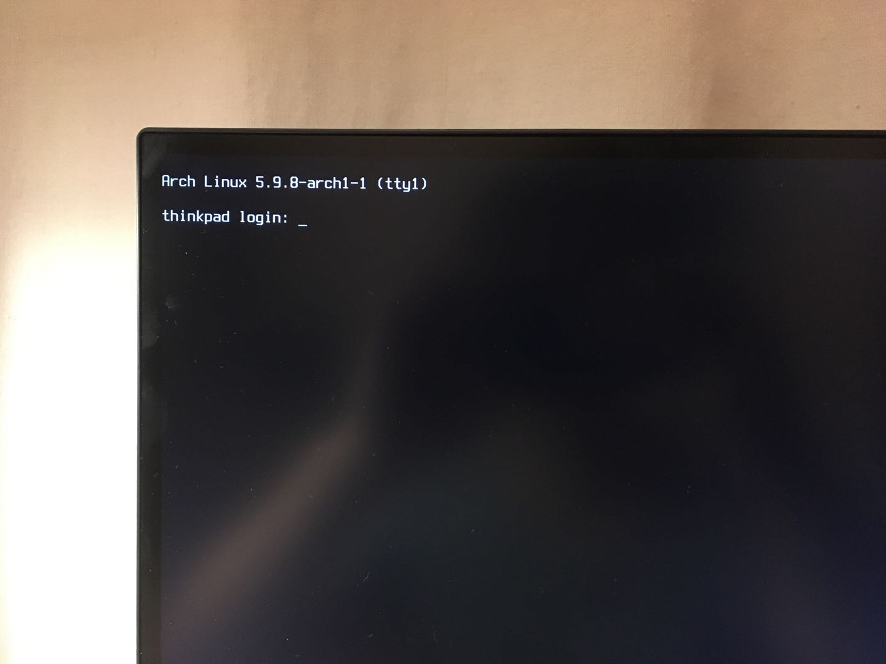
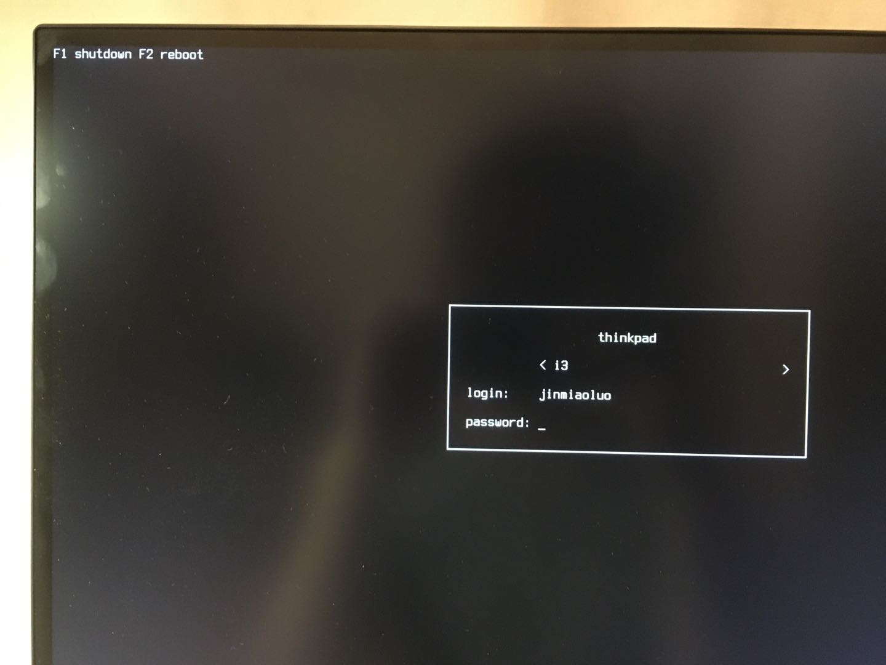
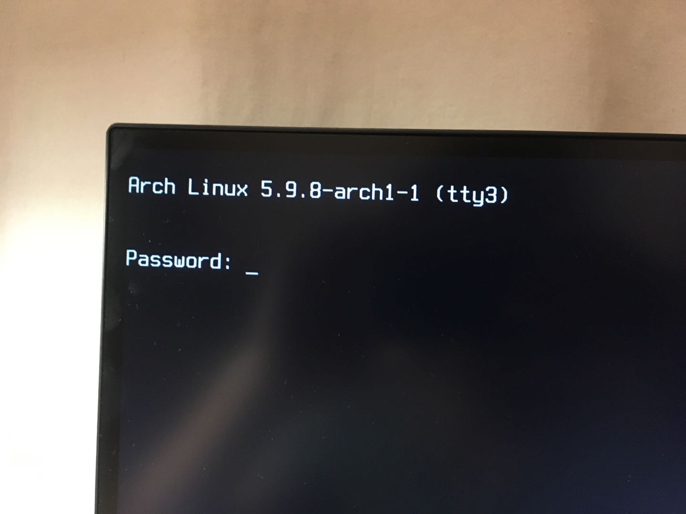
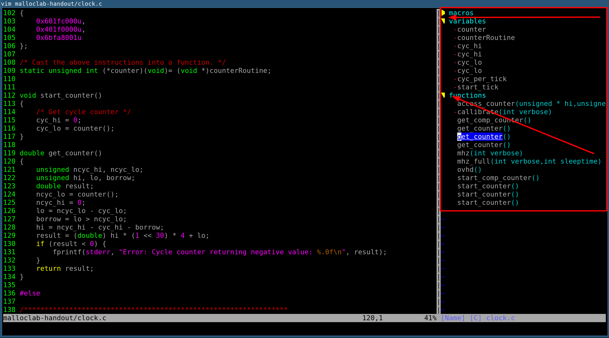

# 2020-11-22 01:39

给我的 Arch Linux 环境添加了 Display Manager.

我的 Arch Linux 环境默认是 `getty` 认证. 如图:



输入用户名和密码, 认证通过后, 再执行 `startx` 打开我的 Window Manger(i3wm).  我一直保持这这样的习惯. 因为, 我认为保持最小可用,
对于我来说就是最完美的了.

不过这会有一个问题, 就是每次认证的过程中, 我都需要输入用户名和密码, 这挺繁琐的.  我期待的是: 只输入密码, 默认记住用户名.
所以这也促使我开始使用 Display Manager. 我所选择的 DM 是: [ly](https://github.com/nullgemm/ly), `ly` 是无图形界面的 DM,
因为是纯文字的. 并且支持记住用户名的功能. 所以选择了它, 效果如下:



继续往下折腾, 发现系统自带的 `getty` 方案, 默认是可以指定用户名的. 比如:

我们要 `tty1` 支持登陆时默认指定一个用户名, 我们只需输入密码, 回车, 即可登陆. 实现步骤如下, 首先执行:

```bash
sudo systemctl disable getty@tty1.service
```

然后, 添加如下配置:

```systemd
[Service]
ExecStart=
ExecStart=-/usr/bin/agetty --skip-login --login-options jinmiaoluo --noclear %I $TERM
```

修改 `jinmiaoluo` 为你默认的用户名即可. 这就是通过 `getty` 指定默认用户名的方法.

效果如下:



因为有多个 `tty`, 我可以在 `tty2` 跑 `ly` + `i3wm`, `tty1` 跑 `sway`. 这样就可以在一台设备上体验不同的 window manager 了.

对了, 我用的是 Arch Linux. 我不是很确定在其他的发行版上是否适用. `sway` 是 Wayland 实现, 所以如果要运行老的 X11 应用,
你需要先安装 `xorg-server-xwayland` 这个包.

# 2020-11-25 11:48

工作上进入下一下状态. 我开始整合公司的监控和报警系统.

- 通过 [client_ruby](https://github.com/prometheus/client_ruby) 暴露数据.
- 通过 [prometheus](https://github.com/prometheus/prometheus) 收集/存储/处理数据.
- 通过 [alertmanager](https://github.com/prometheus/alertmanager) 和 [PrometheusAlert](https://github.com/feiyu563/PrometheusAlert) 实现邮件/短信/电话/IM报警.
- 通过 [grafana](https://github.com/grafana/grafana) 实现监控数据可视化.

参考文档:

- [awesome-prometheus-alerts: prometheus 报警规则集合](https://github.com/samber/awesome-prometheus-alerts)
- [client_ruby: ruby 项目的 proemtheus 集成代码库](https://github.com/prometheus/client_ruby)
- [client_golang: golang 应用的 prometheus 集成代码库](https://github.com/prometheus/client_golang)
- [prometheus-book: prometheus 相关书籍 可以用于该项目的辅助源码阅读](https://github.com/yunlzheng/prometheus-book)
- [prometheus-book: prometheus 相关书籍 可以用于该项目的辅助源码阅读](https://yunlzheng.gitbook.io/prometheus-book/)
- [karma: alertmanager 可视化面板](https://github.com/prymitive/karma)
- [如何给 rails 整合 prometheus 的博客](https://www.robustperception.io/instrumenting-a-ruby-on-rails-application-with-prometheus)
- [client_ruby: 整合 rails 项目的监控数据暴露代码库](https://github.com/prometheus/client_ruby)
- [prometheusAlert: 运维告警消息系统 实现了国内几个办公系统的 API 报警消息的对接](https://github.com/feiyu563/PrometheusAlert)
- [一篇解释 Alertmanager group 概念和相关配置参数的文章, 解释的很详细, 可以看懂](https://www.robustperception.io/whats-the-difference-between-group_interval-group_wait-and-repeat_interval)
- [awesome 项目的 prometheus 分子, 收集了许多关于 prometheus 的资源](https://github.com/roaldnefs/awesome-prometheus)

# 2020-11-28 19:47

开始用 alacritty 取代 xterm.

**为什么要用 alacritty 取代 xterm?**

xterm 的缺点:

1. emoji 显示不完整.
2. 复制命令行的内容, 需要手离开键盘, 通过鼠标来完成.
3. 复制命令行的内容, 如果想让手不离开键盘的情况下实现命令行历史的复制, 需要借助 tmux.
4. 如果使用 tmux, 会导致在 ranger 下无法预览图片.



alacritty 的优点:

1. 默认支持 vi mode, 手不离开键盘, 即可选择并复制命令行中的历史信息.
2. 对 emoji 良好支持. 不会有上面 emoji 缺失的问题.
3. 支持命令行内预览图片.

**接触到 alacritty 的契机**

很久前, sway 的作者有一篇博客, 是关于中国的, 我那时候还不知道他是 sway 的作者, 只是觉得作者似乎对中国有些误解,
于是给他发了一封邮件解释了一下.  后来在 archlinux-cn 的 telegram 群, 听说了 sway (wayland 协议上的类似 i3wm 的实现).
发现原来 sway 的作者也是他, 哈哈, 太巧了. sway 默认用 alacritty, 于是我就记住了. 今天, 午睡过后闲得无事, 对着电脑发呆,
觉得 xterm 的缺点让我有点难受, 于是想找找支持 selection mode 的 terminal simulator. 最后经过了一番 google,
发现原来 alacritty 在 0.4 版已经支持了. 这就是我接触到 alacritty 的契机.

参考文档:

- [ArchWiki 上提到的两个 tips 也很不错](https://wiki.archlinux.org/index.php/Alacritty)
