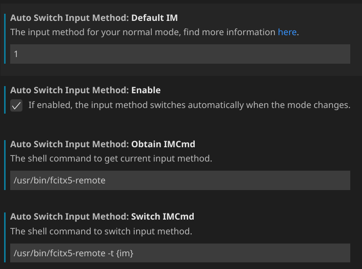
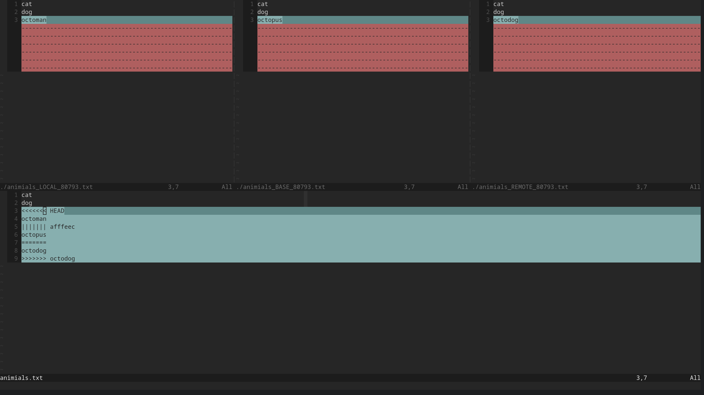
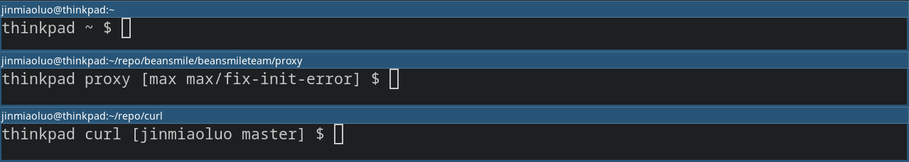

# 2020-12-02 10:08

整合 prometheus 监控和报警后续. 收集了一些相关的文章.

参考文章:

- [rails 项目整合 prometheus, 并通过 rack 添加 basic authentication](https://github.com/crowdAI/crowdai/blob/master/config.ru)
- [来自 discourse 项目的 ruby exporter](https://github.com/discourse/prometheus_exporter)
- [prometheus 的另外一本书, 有整合企业微信报警的介绍](https://songjiayang.gitbooks.io/prometheus/content/alertmanager/wechat.html)
- [上面这本书的源码](https://github.com/songjiayang/prometheus_practice)
- [企业微信 API, 我们需要向企业微信发送文本, 所以文本消息一节需要看看](https://work.weixin.qq.com/api/doc/90000/90135/90236#%E6%96%87%E6%9C%AC%E6%B6%88%E6%81%AF)

# 2020-12-06 21:16

如何通过命令行控制外接显示器的亮度?

我的显示器是 AOC 的 U27P2C. 支持 DDC/CI. 因此, 通过 `ddcutil`
这个工具, 就可以在命令行实现: 信号源的切换, 屏幕亮度, 屏幕对比度的调节等.

这里以亮度调节为例.

你需要启用内核模块 `i2c_dev`.

```shell
modprobe i2c_dev
```

确保内核模块启用了.

```shell
# 输出不为空为启用
lsmod | grep i2c_dev
```

开机自动启用该内核模块.

将下面的内容保存到 `/etc/modules-load.d/i2c_dev.conf`

```shell
i2c_dev
```

注意: 如何开机启用内核模块, 请自行 google, 不同发行版方法不同. 这里提供的方法是
Arch Linux 上可用的.


查看亮度调节的功能如何配置.

```shell
# 这里的 0x60 表示亮度调节功能
ddcutil vcpinfo 0x60 --verbose
```

执行下面的命令设置亮度.

```shell
# 这里的 0x60 表示亮度调节功能, 50 表示 50% 亮度
ddcutil setvcp 0x60 50
```

参考文章:

- [ArchWiki 这篇文章内, 关于外部屏幕相关的亮度调节文档值得一读](https://wiki.archlinux.org/index.php/Backlight)

# 2020-12-24 17:11

fcitx5 如何配置 vscode vim 插件的自动切换输入法?

这块的配置参考了这篇 [blog](https://www.dazhuanlan.com/2020/02/06/5e3b90950e2ec/).

在 vscode 内安装 [vim](https://github.com/VSCodeVim/Vim) 这个插件.

然后在 vim 扩展的配置页面. 添加如下配置即可.



为什么需要自动切换输入法?

当我们在 insert 模式输入中文的时候, 如果我们需要离开 insert 模式, 然后 `j` `k`
`h` `l` 导航, 因为我们此时是中文拼音输入的状态, 输入法会弹出拼音候选的窗口,
而不是简单的输入对应的字符, 上下左右移动. 我们往往需要退出 insert 模式的同时,
手动切换到英文, 然后再执行 normal 模式下的操作. 自动切换指的是, insert
模式在输入中文的时候, 退出 insert 模式的同时, 自动切换到英文输入法,
而不是在退出 insert 模式的时候, 手动切换输入法了. 下次从 normal 模式进入 insert
模式, 恢复之前的输入状态(离开 insert 模式的时候是什么输入法,
恢复的时候就是什么输入法).

现在 vscode vim 插件有什么问题?

vim 插件的 `gq` 命令在输入的内容是中文的时候, 处理的逻辑有误. 在 vim 编辑器中,
中, `gq` 命令会根据实际字符的宽度, 来确保当前的内容满足 `textwidth=80`
(这里假设 `textwidth=80` ) 的需求. ASCII 每个符号宽度是 1, CJK
字符每个字符的宽度是 2. 但是, 在 vscode 的 vim 插件下, 它的逻辑是,
所有的符号宽度都是 1, 这导致在 vscode vim 插件的 `gq`
命令在有中文字符时自动换行的逻辑不正确. 错误在哪呢?

vscode 的 vim 插件在执行 `gq` 命令时, 是确保每行字符个数为 80.
而不是每行字符宽度之和为 80(前面说到了: ASCII 每个符号宽度是 1, CJK
字符每个字符的宽度是 2, 这样的逻辑才是正确的). 这就是错误所在.

# 2020-12-26 19:51

这几天我在看几个比较有名的开源项目. 在看 vim 项目的 README 时, 看到如下的配置:

```shell
git config --global merge.tool vimdiff
git config --global merge.conflictstyle diff3
git config --global mergetool.prompt false
```

这块的配置是用于 git merge 出现 conflict 的时候, 解决 conflict 用的.

我想知道如何用 vim 解决 git 冲突, 添加完上面的配置后, 下面记录一下相关的用法.

如何使用 vim 解决 git merge conflict?

本文参考了这篇[文章](https://www.rosipov.com/blog/use-vimdiff-as-git-mergetool/)

关于如何使用 Fugitive.vim 解决冲突见:
[casts](http://vimcasts.org/episodes/fugitive-vim-resolving-merge-conflicts-with-vimdiff/)

首先, 何时会出现 git merge conflict? 当我们在两个分支, 同时改动同一个文件的时候,
如果我们合并这两条分支, 就可能会出现冲突.

```shell
--C----C1----> A
  |
  |----C2----> B
```

比如我们有这样一个仓库. B 分支的 C2 commit 和 A 分支的 C1 commit
同时改动了同一个文件, 此时, 我们在 A 分支执行 `git merge B` 时便会报错.

此时, git 会有这样的提示:

```shell
thinkpad zoo [jinmiaoluo main] $ git merge B
Auto-merging animials.txt
CONFLICT (content): Merge conflict in animials.txt
Automatic merge failed; fix conflicts and then commit the result.
```

我之前已经执行过上面的 git 配置. 现在我们就可以使用 vim 来解决冲突, 下面执行:

```shell
git mergetool
```

会有如下的界面:



在上面的截图内, vim 被打开, 并出现了 4 个 window.

首先介绍一下最上面的 3 个窗口. 分别是 LOCAL BASE REMOTE. 对应的内容是:

- LOCAL: 我在 A 分支发起的 `git merge` 操作. 所以这里是 A 分支上的 C1 commit
  对应的冲突内容.
- BASE: 共同的祖先. 这个窗口的内容, 是 B 分支从 A 分支分叉出去时 A 的内容.
- REMOTE: 因为我们是要合并 B 分支到 A 分支, 所以这里是 B 分支 C2 commit
  对应的冲突内容.

关于下面这个窗口. 下面这个窗口是当前工作区的内容,
可以认为是我们将要采用的改动出现的地方. 默认执行 `git mergetool` 时,
我们的焦点会被自动定位到这个窗口. 我们需要在这个窗口执行 vim 的 EX 命令. 分别是:

```vim
" diffget 可以使用缩写命令: diffg
" 输入 REMOTE 时可以先输入首字母 + TAB 补全
" 比如我们要采用 REMOTE 的改动时, R + TAB 即可
:diffget RE<TAB>  " get from REMOTE
:diffget BA<TAB>  " get from BASE
:diffget LO<TAB>  " get from LOCAL
```

表示我们将采用对应窗口名字( LOCAL BASE REMOTE )中的的改动.

确定了改动, 保存工作区对应 buffer 的内容. 退出. 然后执行:

```shell
git commit
```

完成这次 merge 操作便结束了.

下面是一些补充:

如果我们的合并操作有多个 conflicts. 可以使用如下的命令:

```vim
]c  " 下一个冲突出现的地方
[c  " 上一个冲突出现的地方
```

我们在解决了一个冲突, 跳到下一个待解决的冲突时, 可以通过:

```vim
" 完整的命令是: `:diffupdate`
:diffup 实时更新这几个窗口的修改情况(比如更新已经修改好的内容的配色)
```

关于 `:diffput`.

这个命令相对于 `:diffget`. 作用是一样的, 都是表示采用哪个窗口的改动. 只是,
我们执行 `:diffget`, 我们所在的窗口表示采用的版本, 表示将某个窗口的改动应用过来.

使用 `:diffput` 时, 我们需要切换到我们想要的改动对应的窗口. 然后执行 `:diffput
<file>` `<file>` 指的是有冲突的文件. 这样, 当前窗口的改动就会被采用了.

这块可以看看前面提到的 casts. 里面的解释会比较容易懂.

# 2020-12-27 00:27

好物记录.

- 4K 27 寸显示器. 我的是 AOC 的 U27P2C.
- Arch Linux 系统的 ThinkPad 笔记本. 我的是 Thinkpad T480. 内存加到了 24 Gbytes.
  硬盘是固态的 512G. 屏幕是 2K 的 IPS 屏幕. 电池我升级到了 96WH(72+24WH),
  有一次在咖啡店办公, 期间运行了一个 windows7 虚拟机, 中度负载, 从下午 2
  点开始一直到下午的 5 点 30 分, 3.5 个小时时间使用了 35% 的电.
  完全足够我中等强度工作 8 个小时的需求.
- 降噪耳机. 这里推荐 Sony WI-1000xm2. 佩戴舒适度很高. 降噪很好用并且很常用.
  WF-1000xm3 相对 WI-1000xm2, 降噪效果明显弱了. 并且, WF-1000xm3 戴久了耳朵会疼,
  因此, 推荐 WI-1000xm2.
- CSAPP. 这是一本书. 全名: Computer Systems: A Programmer's Perspective.

# 2020-12-27 09:46
<!-- TODO: 添加 direnv 的用户记录 -->

[direnv](https://github.com/direnv/direnv) 是什么?

是一个给特定的当前文件夹加载特定环境变量的工具(离开该文件夹后会 unload
这些变量). 因为不同文件夹有不同环境变量, 因此我们可以实现, 不同的文件夹, 根据
direnv 的 .envrc 文件内环境变量的不同, 加载不同的 `git user.name` 和 `git
user.email`. 从而避免 git 提交时, 使用了错误的 user.name. 并且,
下次移动文件夹时也不再需要重新执行:

```shell
git config user.name=username
git config user.email=username@example.com
```

上面的命令用于更新当前项目的 git 用户名/邮箱信息.

关于如何安装? 我是通过 arch 的 AUR 安装的. 如何配置你可以看看官方的 README.md.
上面说的很详细, 这里就不再赘述.

建议添加的配置. 因为我多数时候是在 git 仓库内操作. 因此, 建议看看官方仓库 Wiki
中关于关于如果配置 `.gitignore_global` 的文档. 从而避免误提交.

关于如何通过 direnv 为不同的 git 仓库指定不同的 user.name 和 user.email?

这一块我参考了这篇:
[文章](https://staxmanade.com/2016/05/configuring-git-to-use-different-name-and-email-depending-on-folder-context/).

我在公司的仓库所使用的 git 用户名/邮箱和非公司项目所使用的 git
用户名/邮箱是不同的, 在公司, 我用的 git 用户名和邮箱是这样的:

```shell
git config user.name "Max Luo"
git config user.email "max@beansmile.com"
```

非公司的项目我使用的 git 用户名和邮箱是这样的:

```shell
git config user.name "Jinmiao Luo"
git config user.email "jinmiaoluo@gmail.com"
```

我一般是在我的 `.bashrc` 里面使用如下的函数:

```shell
# 第一次 clone 公司的仓库时执行下面的函数
git-max() {
  git config user.name "max"
  git config user.email "max@beansmile.com"
}

# 第一次 clone 非公司的仓库时执行下面的函数
git-jinmiaoluo() {
  git config user.name "Jinmiao Luo"
  git config user.email "jinmiaoluo@gmail.com"
}
```

另外, 我的 PS1 是这样的:

```shell
git-info () {
  a=$(git config --get user.name | cut --delimiter=' ' --fields=1)
  b=$(git rev-parse --abbrev-ref HEAD 2>/dev/null)
  if [ -n "$b" ]; then
    echo -n " [$a $b]"
  else
    echo -n ""
  fi
}
PS1="\h \W\$(git-info) $ "
```

这样, 我就可以知道我当前仓库的 git 用户名和邮箱是否有错误.

效果大概是这样:



采用 direnv 后, 上面的两个函数变成了这样:

```shell
# 第一次 clone 公司的仓库时执行下面的函数
git-max() {
  git config user.name "Max Luo"
  git config user.email "max@beansmile.com"
  [[ -f ".envrc" ]] && grep 'GIT_AUTHOR_NAME' .envrc &>/dev/null
  [[ $? -eq 1 ]] && echo -e "export GIT_AUTHOR_EMAIL=max@beansmile.com\nexport GIT_AUTHOR_NAME='Max Luo'\nexport GIT_COMMITTER_EMAIL=max@beansmile.com\nexport GIT_COMMITTER_NAME='Max Luo'" >> .envrc
  direnv allow
}

# 第一次 clone 非公司的仓库时执行下面的函数
git-jinmiaoluo() {
  git config user.name "Jinmiao Luo"
  git config user.email "jinmiaoluo@gmail.com"
  [[ -f ".envrc" ]] && grep 'GIT_AUTHOR_NAME' .envrc &>/dev/null
  [[ $? -eq 1 ]] && echo -e "export GIT_AUTHOR_EMAIL=jinmiaoluo@gmail.com\nexport GIT_AUTHOR_NAME='Jinmiao Luo'\nexport GIT_COMMITTER_EMAIL=jinmiaoluo@gmail.com\nexport GIT_COMMITTER_NAME='Jinmiao Luo'" >> .envrc
  direnv allow
}
```

direnv 出于安全考虑. 在加载 `.envrc` 中的环境变量前, 会询问是否加载, 我们执行
`direnv allow` 允许自动加载. 这样, 进入/离开仓库的目录.  我们在 `.envrc`
中定义的环境变量便会自动加载/自动清除. 这样, 即使我们的仓库重命名, 或者,
将仓库移动到了其他文件夹. 我们也不需要再执行 `git-max` 或者 `git-jinmiaoluo`
这两个函数.
